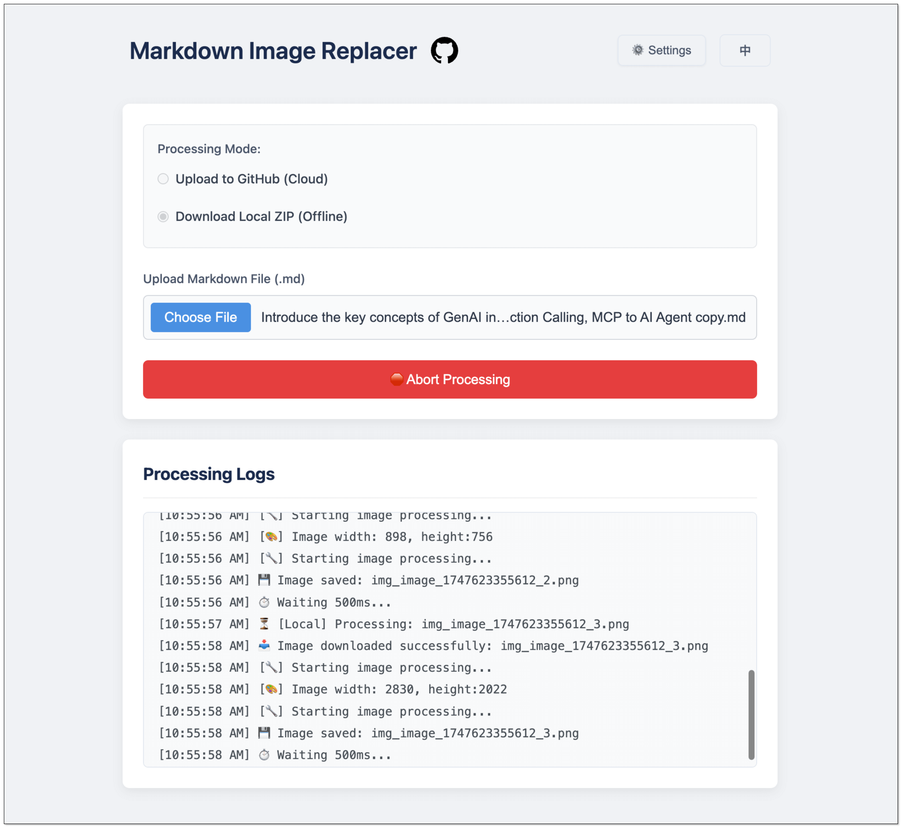

# Markdown Image Replacer

⚡ A tool for replacing image links in Markdown files.

[](https://github.com/hellojuantu/markdown-image-replacer/actions)
[](https://hub.docker.com/r/barrylogen/markdown-image-replacer-backend)
[](https://hub.docker.com/r/barrylogen/markdown-image-replacer-frontend)
[](LICENSE)
[](#tech-stack)

English | [中文](README.zh-CN.md)



## Index

- [Features](#features)
- [Tech Stack](#tech-stack)
- [Quick Start](#quick-start)
- [Usage Guide](#usage-guide)
- [Configuration](#configuration)
- [Contributing](#contributing)
- [License](#license)

## Features

- **Dual Modes**
  - GitHub Mode: Upload to repo & update links
  - Local Mode: Download as ZIP
- **Image Optimization**: Optional TinyPNG compression

## Tech Stack

- Frontend: React + TypeScript
- Backend: Node.js + TypeScript
- Image: TinyPNG API (optional)

## Quick Start

### One-Click Installation

```bash
/bin/bash -c "$(curl -fsSL -H 'Accept: application/vnd.github.v3.raw' https://api.github.com/repos/hellojuantu/markdown-image-replacer/contents/docker/install_run.sh)"
```

Access：http://localhost:13001


### One-Click Upgrade

```bash
/bin/bash -c "$(curl -fsSL -H 'Accept: application/vnd.github.v3.raw' https://api.github.com/repos/hellojuantu/markdown-image-replacer/contents/docker/upgrade.sh)"
```

### One-Click Uninstallation

```bash
/bin/bash -c "$(curl -fsSL -H 'Accept: application/vnd.github.v3.raw' https://api.github.com/repos/hellojuantu/markdown-image-replacer/contents/docker/uninstall.sh)"
```

## Manual Setup

### Docker Installation

1. Install Docker and Docker Compose
2. Clone and run:
   ```bash
   git clone https://github.com/hellojuantu/markdown-image-replacer.git
   cd markdown-image-replacer/docker
   echo 'APP_VERSION=0.0.2' > .env
   docker compose up --build -d
   ```
3. Access: `http://localhost:13001`

### Development Setup

1. Install dependencies:
   ```bash
   # Front-end
   cd frontend && npm install
   # Back-end
   cd ../backend && npm install
   ```
2. Run servers:
   ```bash
   # Front-end
   cd frontend && npm run dev
   # Back-end
   cd ../backend && npm run start
   ```

## Usage Guide

1. **Choose Mode**
   - GitHub: Upload to repo
   - Local: Download ZIP

2. **Process File**
   - Upload Markdown file
   - Enable compression (optional)
   - Start processing

3. **Get Results**
   - GitHub: Copy updated Markdown
   - Local: Download ZIP

## Configuration

### GitHub Settings

If you choose to upload images and replace links using GitHub mode, you need to prepare a public repository and provide an access token. Below are the configuration fields and setup instructions:

#### Required Fields

| Field      | Description                                                   |
|------------|---------------------------------------------------------------|
| Username   | Your GitHub username (e.g., `hellojuantu`)                    |
| Repository | Name of the repo used to store images (e.g., `image-host`)    |
| Branch     | Target branch (default: `main`)                               |
| Token      | GitHub access token with `repo` permissions                   |

#### Steps to Create a Repository and Token

1. **Create a Repository**
    - Visit [https://github.com/new](https://github.com/new)
    - Enter a repository name, e.g., `image-host`
    - Choose **Public**
    - Click **Create repository**
    - Follow prompts to initialize with a branch (e.g., `main`)

2. **Generate a GitHub Token**
    - Go to [https://github.com/settings/tokens](https://github.com/settings/tokens)
    - Click **Generate new token (classic)**
    - Select the `repo` scope (including `repo:status`, `repo_deployment`, `public_repo`, `repo:invite`)
    - Copy the generated token (Note: it's shown only once, so store it securely)

3. **Fill in the Configuration**
    - On the tool page, enter the following:
        - Username: your GitHub account name
        - Repository: the name you just created, e.g., `image-host`
        - Branch: the initialized branch name, e.g., `main`
        - Token: paste the GitHub token you just copied

### Image Settings

| Field             | Description                                                                 |
|-------------------|-----------------------------------------------------------------------------|
| Enable Compression | Whether to compress images using TinyPNG                                   |
| TinyPNG API Key    | Available from the [TinyPNG Developer Page](https://tinypng.com/developers) |

## Contributing

Contributions are welcome! Please open an issue or submit a pull request for any improvements or bug fixes.

## License

MIT License - see [LICENSE](LICENSE)
