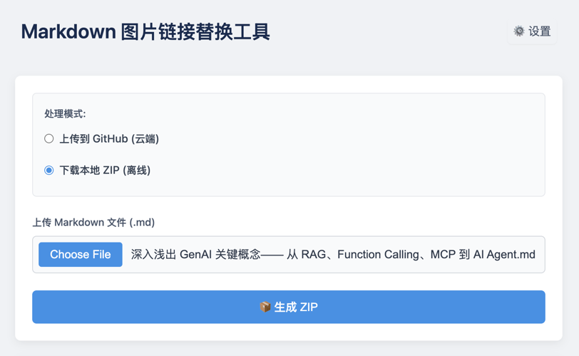

# Markdown Image Replacer

[English](README.md) | [中文](README.zh-CN.md)

This tool processes image links in Markdown files, supporting two modes:
- **GitHub Mode**: Upload images to a GitHub repository and update links in your Markdown.
- **Local Mode**: Download a ZIP archive containing all images.



## Features

- **GitHub Mode**: Automatically upload images to GitHub and rewrite links.
- **Local Mode**: Fetch images into a ZIP for offline use.
- **Compression**: Optional TinyPNG API integration for image optimization.
- **Live Logs**: Stream processing logs in real time.
- **Cancelable**: Stop processing at any time.

## Tech Stack

- **Front-end**: React + TypeScript
- **Back-end**: Node.js + TypeScript
- **Image Processing**: TinyPNG API (optional)

## Docker Usage

### One-Click Installation (Recommended)
```bash
/bin/bash -c "$(curl -fsSL https://raw.githubusercontent.com/hellojuantu/markdown-image-replacer/refs/heads/main/docker/install_run.sh)"
```

### Manual Installation
1. Install Docker and Docker Compose
2. Clone the repo:
   ```bash
   git clone https://github.com/hellojuantu/markdown-image-replacer.git
   cd markdown-image-replacer/docker
   ```
3. Start services:
   ```bash
   echo 'APP_VERSION=0.0.1' > .env
   docker-compose up -d
   ```
4. Visit: `http://localhost:13001`
5. Tail logs:
   ```bash
   docker-compose logs -f
   docker-compose logs -f frontend
   docker-compose logs -f backend
   ```
6. Stop services:
   ```bash
   docker-compose down
   ```

## Development Setup

1. Install dependencies:
   ```bash
   # Front-end
   cd frontend
   npm install

   # Back-end
   cd ../backend
   npm install
   ```
2. Run dev servers:
   ```bash
   # Front-end
   cd frontend
   npm run dev

   # Back-end
   cd ../backend
   npm run start
   ```

## Usage

1. **Select mode**
   - GitHub Mode: configure your repo info
   - Local Mode: ZIP download

2. **Upload `.md` file**
3. **Options**
   - Enable compression (TinyPNG API key required)

4. **View results**
   - GitHub: copy updated Markdown
   - Local: download ZIP

## Configuration

### GitHub Config
- **Username**: your GitHub user
- **Repo**: target repository
- **Branch**: target branch
- **Token**: Personal Access Token with `repo` scope

### Compression Config
- **Enable**: toggle TinyPNG
- **API Key**: your TinyPNG API key

## License

This project is licensed under the MIT License. See [LICENSE](LICENSE) for details.
