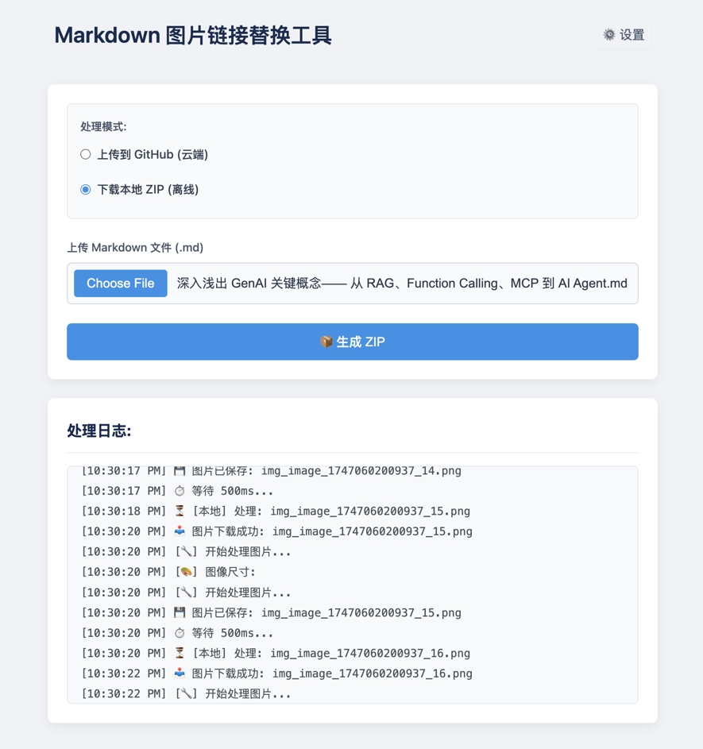

# Markdown 图片链接替换工具

[English](README.md) | [中文](README.zh-CN.md)

这是一个用于处理 Markdown 文件中图片链接的工具，支持两种模式：
- **GitHub 模式**：将图片上传到 GitHub 仓库并更新 Markdown 中的链接
- **本地模式**：下载包含所有图片的 ZIP 包



## 功能特点

- 支持 **GitHub 模式** 和 **本地模式**
- 可选 **图片压缩**（TinyPNG API）
- 实时 **处理日志**
- 支持 **查看/复制** 处理结果
- 可随时 **取消** 正在进行的操作

## 技术栈

- 前端：React + TypeScript
- 后端：Node.js + TypeScript
- 图片处理：TinyPNG API（可选）

## 使用 Docker 运行

1. 安装 Docker 和 Docker Compose
2. 克隆仓库：
   ```bash
   git clone https://github.com/hellojuantu/markdown-image-replacer.git
   cd markdown-image-replacer
   ```
3. 启动服务：
   ```bash
   docker-compose up -d
   ```
4. 访问应用：http://localhost:13001
5. 查看日志：
   ```bash
   docker-compose logs -f
   docker-compose logs -f frontend
   docker-compose logs -f backend
   ```
6. 停止服务：
   ```bash
   docker-compose down
   ```

## 开发环境设置

1. 安装依赖：
   ```bash
   # 前端依赖
   cd frontend
   npm install

   # 后端依赖
   cd ../backend
   npm install
   ```
2. 启动开发服务器：
   ```bash
   # 前端
   cd frontend
   npm run dev

   # 后端
   cd ../backend
   npm run dev
   ```

## 使用说明

1. 选择处理模式：
   - GitHub 模式：需配置仓库信息
   - 本地模式：生成 ZIP 包

2. 上传 Markdown 文件（`.md`）
3. 配置选项：
   - 是否启用 TinyPNG 压缩（需 API Key）
4. 查看结果：
   - GitHub 模式：复制更新后的 Markdown
   - 本地模式：下载 ZIP

## 配置说明

### GitHub 配置
- 用户名：GitHub 账号
- 仓库名：目标仓库
- 分支：目标分支
- Token：需 `repo` 权限的 Personal Access Token

### 图片压缩配置
- 启用压缩：勾选 TinyPNG
- API Key：从 TinyPNG 官网获取

## 许可证

本项目采用 MIT 许可证。详情请参见 [LICENSE](LICENSE) 文件。 
