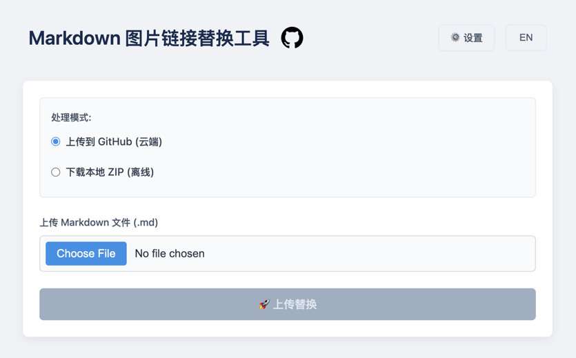

# Markdown 图片替换器

⚡ 一款 Markdown 图片链接的替换工具

[](https://github.com/hellojuantu/markdown-image-replacer/actions)
[](https://hub.docker.com/r/barrylogen/markdown-image-replacer-backend)
[](https://hub.docker.com/r/barrylogen/markdown-image-replacer-frontend)
[](LICENSE)
[](#tech-stack)

[English](README.md) | 中文



## 目录

- [功能](#功能)
- [技术栈](#技术栈)
- [快速开始](#快速开始)
- [使用指南](#使用指南)
- [配置](#配置)
- [贡献](#贡献)
- [许可证](#许可证)

## 功能特点

- **双模式支持**
  - GitHub 模式：上传到仓库并更新链接
  - 本地模式：下载为 ZIP 压缩包
- **图片优化**：可选的 TinyPNG 压缩

## 技术栈

- 前端：React + TypeScript
- 后端：Node.js + TypeScript
- 图片处理：TinyPNG API（可选）

## 快速开始

### 一键安装

```bash
/bin/bash -c "$(curl -fsSL https://raw.githubusercontent.com/hellojuantu/markdown-image-replacer/refs/heads/main/docker/install_run.sh)"
```

### 一键升级

```bash
/bin/bash -c "$(curl -fsSL https://raw.githubusercontent.com/hellojuantu/markdown-image-replacer/refs/heads/main/docker/upgrade.sh)"
```

### 一键卸载

```bash
/bin/bash -c "$(curl -fsSL https://raw.githubusercontent.com/hellojuantu/markdown-image-replacer/refs/heads/main/docker/uninstall.sh)"
```

## 手动安装

### Docker 安装

1. 安装 Docker 和 Docker Compose
2. 克隆并运行：
   ```bash
   git clone https://github.com/hellojuantu/markdown-image-replacer.git
   cd markdown-image-replacer/docker
   echo 'APP_VERSION=0.0.2' > .env
   docker compose up --build -d
   ```
3. 访问：`http://localhost:13001`

### 开发环境

1. 安装依赖：
   ```bash
   # 前端
   cd frontend && npm install
   # 后端
   cd ../backend && npm install
   ```
2. 运行服务：
   ```bash
   # 前端
   cd frontend && npm run dev
   # 后端
   cd ../backend && npm run start
   ```

## 使用指南

1. **选择模式**
   - GitHub：上传到仓库
   - 本地：下载 ZIP

2. **处理文件**
   - 上传 Markdown 文件
   - 启用压缩（可选）
   - 开始处理

3. **获取结果**
   - GitHub：复制更新后的 Markdown
   - 本地：下载 ZIP

## 配置

### GitHub 配置项

若使用 GitHub 模式上传图片并替换链接，需提前准备一个公开或私有仓库，并提供访问凭证。以下是配置说明及操作步骤：

#### 基本配置字段

| 字段        | 说明                          |
|-------------|-----------------------------|
| 用户名      | GitHub 用户名（如：`hellojuantu`） |
| 仓库名      | 用于存储图片的仓库名称（如：`image-host`）             |
| 分支        | 默认为 `main`                  |
| Token       | GitHub 访问令牌，需有 `repo` 权限    |

#### 如何创建一个 GitHub 仓库并获取配置

1. **创建仓库**
   - 打开 [https://github.com/new](https://github.com/new)
   - 填写仓库名称，如：`image-host`
   - 选择 Public
   - 点击 **Create repository**

2. **生成 GitHub Token**
   - 打开 [https://github.com/settings/tokens](https://github.com/settings/tokens)
   - 点击 **"Generate new token (classic)"**
   - 勾选 `repo` 权限（包括 `repo:status`, `repo_deployment`, `public_repo`, `repo:invite`）
   - 复制生成的 Token（注意：只显示一次，请妥善保存）

3. **填写配置信息**
   - 在工具页面中输入上述信息：
      - 用户名：你的 GitHub 账户名
      - 仓库名：刚创建的仓库名，默认填 `image-host`
      - 分支：默认填 `main`
      - Token：粘贴刚刚复制的 GitHub Token

### 图片设置

| 字段         | 说明                     |
|--------------|--------------------------|
| 启用压缩     | 是否启用 TinyPNG 压缩    |
| TinyPNG 密钥 | 可在 [官网](https://tinypng.com/developers) 获取 |

## 贡献
欢迎贡献！如有改进或修复，请打开 issue 或提交 Pull Request。

## 许可证

MIT 许可证 - 详见 [LICENSE](LICENSE)
